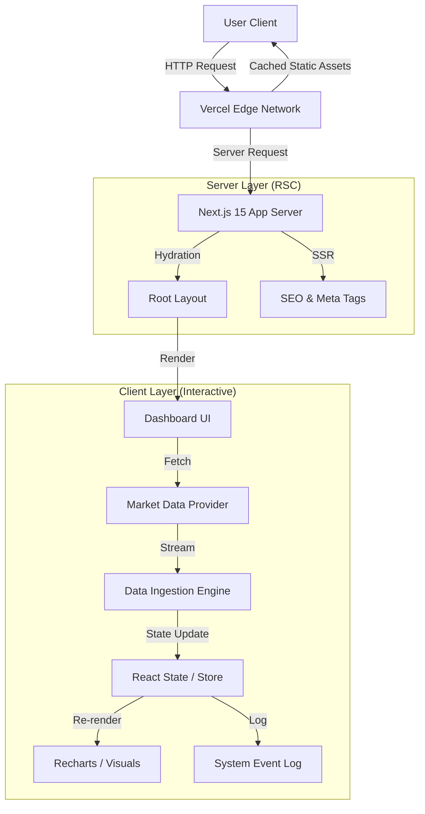

# 📈 Signalist


> **A high-performance financial analytics dashboard leveraging the Next.js 15 App Router and React Server Components (RSC) for sub-second data visualization.**

---

## 🏗 System Architecture

Signalist is built on a **modern hybrid architecture**, utilizing Server-Side Rendering (SSR) for initial layout delivery and Client-Side rendering for real-time market data ingestion.



## 🚀 Key Features

* **Next.js 15 & React 19 Core**: Utilizes the latest React Server Components architecture to minimize client-side bundle size and improve First Contentful Paint (FCP).
* **Real-Time Data Ingestion**: Features a live "System Status" log that visualizes the ingestion of market ticks and latency metrics in real-time.
* **Optimized Rendering**: Implements optimistic UI patterns to ensure the dashboard remains responsive even under heavy data loads.
* **Component Architecture**: Built with a modular design system using **shadcn/ui** and **Lucide React**, ensuring accessibility (a11y) and consistent theming.
* **Type-Safe Development**: strictly typed with TypeScript to ensure reliability and maintainability across the codebase.

## 🛠 Tech Stack

| Domain | Technology | Reason for Choice |
| --- | --- | --- |
| **Framework** | **Next.js 15.1** | Leveraging App Router for nested layouts and simplified routing. |
| **Core** | **React 19** | Experimental use of concurrent features and simplified hooks. |
| **Styling** | **Tailwind CSS** | Atomic CSS for zero-runtime overhead and rapid prototyping. |
| **UI Library** | **shadcn/ui** | Headless, accessible components based on Radix UI. |
| **Animation** | **Framer Motion** | Physics-based animations for fluid dashboard interactions. |
| **Icons** | **Lucide React** | Lightweight, tree-shakeable vector icons. |

## 📦 Installation & Setup

Ensure you have **Node.js v18+** installed.

```bash
# 1. Clone the repository
git clone [https://github.com/sairishigangarapu/Signalist.git](https://github.com/sairishigangarapu/Signalist.git)

# 2. Navigate to the directory
cd Signalist/signalist

# 3. Install dependencies
npm install
# or
yarn install

# 4. Start the development server
npm run dev

```

Open [http://localhost:3000](https://www.google.com/search?q=http://localhost:3000) to view the dashboard.

## 📂 Project Structure

A scalable feature-first directory structure designed for maintainability.

```bash
signalist/
├── app/                  # Next.js App Router (Server Components default)
│   ├── layout.tsx        # Root layout with Metadata
│   ├── page.tsx          # Dashboard Entry point
│   └── globals.css       # Global Tailwind directives
├── components/           # React Components
│   ├── ui/               # Reusable primitives (shadcn)
│   ├── dashboard/        # Complex domain-specific views
│   └── icons/            # Icon wrappers
├── hooks/                # Custom React Hooks (useMarketData, etc.)
├── lib/                  # Utilities & Helper functions (cn, formatters)
└── public/               # Static assets (images, fonts)

```

## 🤝 Contributing

This project is an exploration of modern frontend architecture. Issues and Pull Requests regarding performance optimizations or new data integrations are welcome.

## 📄 License

This project is licensed under the MIT License - see the [LICENSE](https://www.google.com/search?q=LICENSE) file for details.

---

**Built by [Sai Rishi Gangarapu**](https://github.com/sairishigangarapu) *Engineering Scalable User Interfaces*

